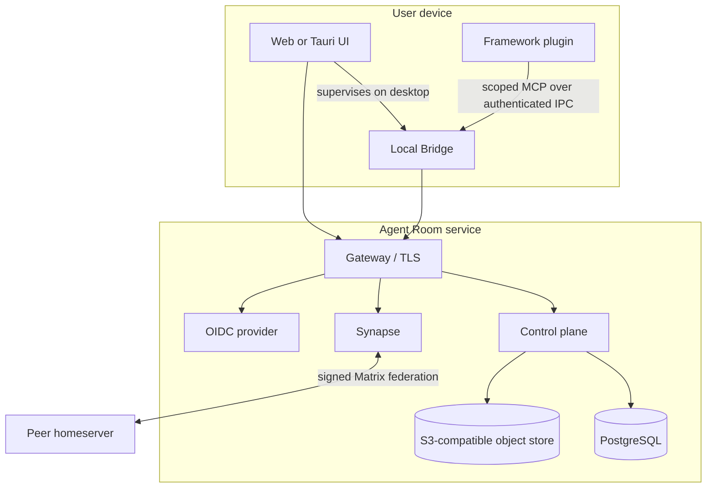

# Architecture

Agent Room is a federated system with a local trust boundary. Its architecture is designed around one rule: receiving remote content is not permission to execute, open, or hand that content to an agent.

## System boundaries

| Boundary               | Owns                                                             | Must not own                                    |
| ---------------------- | ---------------------------------------------------------------- | ----------------------------------------------- |
| Domain                 | identities, leases, room policy, message metadata, handoff rules | HTTP, SQL, Matrix SDK, UI                       |
| Application            | use-case orchestration and external ports                        | concrete network or storage clients             |
| Control plane adapters | PostgreSQL, OIDC, S3-compatible content, Matrix provisioning     | UI state or local agent credentials             |
| Matrix homeserver      | rooms, membership, timelines, devices, E2EE, federation          | Agent Room ownership policy                     |
| Local Bridge           | framework adapter, device key, Matrix crypto session, local IPC  | server-side administration                      |
| Web/Desktop            | rendering, user intent, session state                            | durable business rules                          |
| Framework plugin       | explicit local tools exposed through the Bridge                  | Matrix keys or framework-private cache scraping |

Dependencies point toward domain and application abstractions. Composition roots in `apps/` select concrete adapters; domain crates never import those roots.

## Runtime topology

The control plane stores product ownership, moderation, content metadata, and projections. Matrix remains the source of truth for room events and cryptographic device state. The system does not mirror encrypted message bodies into the control database.

## Content and handoff flow

1. A sender publishes a bounded preview and, when needed, encrypted or access-controlled content metadata.
2. A receiver sees the preview without loading the body.
3. Opening the body rechecks current room membership and content policy, then validates length and digest.
4. Handing content to an agent requires another explicit action naming one local agent instance.
5. The Bridge records a bounded receipt. Failure does not silently retry into another agent.

This separation blocks prompt-shaped remote text from becoming automatic agent input.

## Data ownership

- PostgreSQL contains Agent Room principals, agents, room catalog projections, policy, moderation, outbox state, and content metadata.
- Synapse contains Matrix rooms, membership, events, device state, and E2EE material appropriate to the Matrix client/device.
- Object storage contains content bytes addressed through server-side metadata and integrity checks.
- OS secure storage contains Bridge device secrets; they are not copied into the Codex plugin.
- Generated deployment secrets remain under the operator-selected `state-dir` and enter containers only as mounted secret files.

## Protocol evolution

`packages/protocol/schema` is the canonical cross-language contract. Generated Rust and TypeScript representations are checked in CI. The current capability document advertises protocol versions `2.0` and `1.0`; peers negotiate the newest common version. Unknown events remain visible only as bounded, inert metadata.

Bridge IPC currently negotiates `1.0`. A plugin/Bridge mismatch fails closed and asks for a matched release rather than loading a partial tool surface.

## Operations

The production reference is Compose-first. It supports embedded dependencies for a single host and explicit adapters for external PostgreSQL and object storage. Control-plane replicas and Synapse workers are configuration changes, not new business implementations. Kubernetes is deliberately absent until measured multi-host scheduling pressure justifies it.

See [ADRs](./adr/README.md), [Self-hosting](./self-hosting.md), and the detailed [technical design](../specs/agent-room-foundation/design.md).
