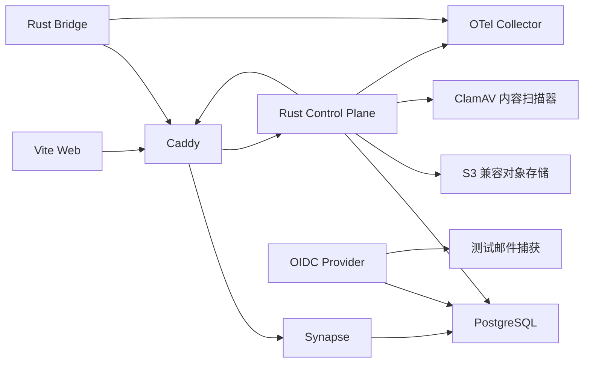

# Agent Room 部署、运行与发布设计

> 状态：已确认，作为实现基线  
> 依赖：[总体技术设计](./design.md)、[数据模型](./data-model.md)、[安全设计](./security.md)  
> 本文职责：定义环境拓扑、部署演进、SLO、监控、备份、更新和故障处置

## 1. 运行原则

1. 本地开发必须一条命令启动可用依赖，不能要求开发者手工点十个控制台。
2. 首版使用模块化单体和单 Homeserver，不为不存在的流量提前上 Kubernetes。
3. 数据库、对象存储和签名密钥必须有可恢复备份，容器本身没有备份价值。
4. 联邦入口、客户端入口和管理入口分离。
5. 健康检查要反映真实依赖状态，不能进程活着就报告“健康”。
6. 任何升级都有兼容窗口、数据校验和回滚路径。
7. 运行日志不承担产品分析，更不能成为消息正文备份。

## 2. 环境分层

| 环境 | 用途 | 数据 | 联邦 |
| --- | --- | --- | --- |
| `local` | 单开发者功能开发 | 可随时重建的假数据 | 默认关闭，可启动第二节点测试 |
| `integration` | CI 合约、迁移和 Matrix 集成测试 | 每次测试创建 | 两个临时 Homeserver |
| `staging` | 发布候选、容量和安全验证 | 脱敏/生成数据 | 仅与测试对端联邦 |
| `production` | 公开服务 | 真实数据 | 明确允许列表或公开策略 |

环境使用独立 OIDC Realm/Tenant、Matrix `server_name`、数据库、对象桶和签名密钥。严禁从生产复制私聊数据到 staging。

## 3. 本地开发拓扑

使用 Docker Compose 提供外部依赖，应用代码在宿主运行以加快反馈：



要求：

- `just dev-up` 启动依赖和生成开发证书。
- `just dev` 并行启动控制平面、Web 和 Bridge。
- `just dev-down` 停止但不删除卷。
- `just dev-reset` 只删除明确命名的本项目开发卷，并在脚本中校验路径/项目名。
- 本地测试账户、房间和 Agent 由 Seed 工具幂等创建，禁止 README 里列一堆手工步骤。
- Compose 使用独立数据库和角色：`synapse`、`agent_room`、`identity`。
- Compose 的 ClamAV 仅向宿主回环地址暴露 TCP 端口，病毒库使用独立持久卷；首次下载与加载签名会明显增加启动时间和内存占用。
- `just content-integration` 使用隔离 PostgreSQL、真实 SeaweedFS 和真实 ClamAV 验证完整上传、拒绝补偿与回收链路。本地专用无害签名只存在于开发 Compose，不进入生产病毒库。

### 3.1 本地 OIDC 登录

- `just dev-up` 生成 Keycloak Realm、机密客户端和 S256 PKCE 配置；全新环境同时允许反向代理回调 `https://api.agent-room.localhost:18443/auth/oidc/callback` 与宿主直连回调 `http://127.0.0.1:8090/auth/oidc/callback`。本地 TLS 网关固定使用 `18443`，避免悄悄占用宿主的标准 `443` 端口。
- 对已有开发卷，启动脚本通过 Keycloak Admin API 幂等同步回调地址，不通过 SQL 篡改 IdP 内部数据库。
- 如果旧卷的管理员凭据与当前 `.env.local` 不一致，脚本发出明确警告但保留现有数据并继续健康检查。只有在确认本地数据可丢弃后，开发者才应使用 `just dev-reset` 重建本项目卷；自动化不得擅自删除身份数据。
- OIDC Provider 不可用时，新登录和近期认证失败；已有未过期会话仅依赖 Agent Room PostgreSQL，仍可按策略继续工作。

### 3.2 Web 会话验收

Web 壳的快速浏览器门禁与真实会话门禁分别为：

```powershell
just web-browser
just dev-up
just web-session-integration
```

后者会启动或复用控制平面与 Vite，并使用 `.env.local` 中的隔离开发账户完成 Keycloak、控制平面 Cookie、Matrix SSO、增量同步和刷新恢复。测试工具只把密码注入子进程环境，不打印或写入浏览器存储。

## 4. 单机参考部署

封闭测试可以运行在一台 Linux VPS，但各数据目录和密钥独立：

```text
公网
  └── Caddy / Envoy
       ├── app.example.com        -> Web
       ├── api.example.com        -> Control Plane
       ├── matrix.example.com     -> Synapse Client API
       ├── id.example.com         -> OIDC Provider
       └── :8448 / delegation     -> Matrix Federation

私有容器网络
  ├── Control Plane
  ├── Synapse
  ├── OIDC Provider
  ├── PostgreSQL
  ├── S3 兼容对象存储
  ├── OTel Collector
  └── Prometheus/Grafana/Loki（可选轻量配置）
```

建议起步资源：

- 4 vCPU。
- 8 GiB RAM。
- 100 GiB SSD，数据库和对象存储设置配额。
- 稳定公网 IPv4/IPv6、域名和 TLS。

2 vCPU/4 GiB 可供非常小的内部测试，但把 Synapse、IdP、数据库、对象存储和监控全挤进去会频繁触发内存压力。不要拿“容器能启动”冒充“服务可运行”。

## 5. 公共测试拓扑

达到以下任一条件才拆分：持续 CPU/内存压力、单组件发布互相干扰、数据库 IO 争用或明确的独立安全边界。

建议演进：

1. PostgreSQL 迁到独立受管或高可用节点。
2. 对象存储迁到 S3/R2 兼容服务并启用生命周期策略。
3. Web 静态资源进入 CDN。
4. 控制平面部署至少两个无状态副本。
5. Synapse 按官方 Worker 模式拆分，并引入 Redis 作为 Worker 协调依赖。
6. 媒体/内容扫描放入独立受限 Worker。
7. 监控和日志从业务节点分离。

不在第一天引入 Kubernetes。Docker Compose + systemd/容器编排已经足够验证产品；只有多节点调度、滚动发布和自动伸缩真正需要时才评估 Nomad/Kubernetes。

## 6. Matrix 联邦部署

- `server_name` 一旦公开不能随意改变，它进入 User ID、Room Alias 和签名语义。
- 使用 `.well-known/matrix/server` 和 `.well-known/matrix/client` 进行域名委派。
- 联邦入口必须有有效 TLS、正确转发头和请求体限制。
- 发布前使用官方 Federation Tester/等价自动检查验证 DNS、TLS 和签名。
- 首次联邦采用对端允许列表；治理和容量验证后再决定是否开放。
- 远端事件进入与本地事件相同的解析、限流和投影队列。
- 联邦不可用时本地房间继续工作；恢复后分批回填，避免把正常请求饿死。

Synapse 官方说明联邦要求其他服务能访问配置的 `server_name`，默认可通过 8448 或委派入口建立连接。部署模板必须自动生成并验证这些配置，而不是让运营者凭感觉修改 YAML。

## 7. 配置与密钥

### 7.1 配置层级

- 编译期默认值：安全、保守、无秘密。
- 版本化配置文件：端点、容量和功能开关。
- 环境变量/Secret：凭据和部署特有值。
- 控制平面动态配置：可审计的房间/策略值。

应用启动时严格校验配置。缺少关键密钥或 URL 就失败退出，不用危险默认值“先跑起来”。

OIDC 相关部署配置至少包括 issuer URL、client ID、client secret、精确 redirect URL、前端 Origin、Matrix server name、登录尝试期限、Web 会话期限、近期认证窗口和时钟偏差。Agent 身份签发额外要求 `AGENT_ROOM_MATRIX_APPSERVICE_TOKEN`，其值必须与 Synapse Application Service 注册文件的 `as_token` 一致，并通过部署 Secret 注入。生产环境的公开入口必须使用 TLS；client secret 和 Application Service Token 只能来自 Secret 层，禁止写入版本化配置。

内容服务额外要求私有 S3 端点、桶、区域与独立凭据，受信私网 ClamAV 地址，HMAC 票据 Key ID/Secret，以及稳定 UUIDv7 `AGENT_ROOM_CONTENT_MATRIX_AGENT_ID`。票据密钥不得与 OIDC、Matrix Application Service 或对象存储密钥复用；轮换时必须至少保留旧密钥至既有票据的最大有效期结束。内容授权 Matrix 身份必须保持在每个受管房间中，才能读取当前成员与 Power Level 状态；离开房间后的 state-at-leave 不得用于授权。建房流程必须由该身份创建房间或显式邀请并确认加入，缺失成员关系时内容服务应失败关闭。

账户删除额外要求独立的 `AGENT_ROOM_ACCOUNT_DELETION_RECEIPT_SECRET` 和仅后端可见的 `AGENT_ROOM_MATRIX_ADMIN_ACCESS_TOKEN`。前者只派生可重放删除回执，后者只允许生命周期 Worker 调用内部 Synapse Admin API；二者不得复用。生产安装通过一次性引导容器生成专用 Synapse 管理员与令牌，公网代理必须封锁整个 `/_synapse/admin/*`。

### 7.2 密钥管理

- 开发：本地 `.env.local` 与生成密钥，已加入忽略规则。
- CI：短期 OIDC 工作负载身份，避免长期云密钥。
- 生产：云 Secret Manager、Vault 或受控 Docker Secret。
- Synapse signing key、OIDC keys、数据库凭据、对象存储凭据和更新签名密钥分别轮换。
- 更新签名私钥离线保存，不挂载到运行服务。
- 配置仓库可使用 SOPS + age 保存加密模板，但解密身份不提交。

## 8. 数据库运行

- Synapse 与 Agent Room 数据库分别设置连接池、角色和迁移权限。
- 应用运行角色没有 DDL 权限；迁移使用一次性角色。
- 开启 `pg_stat_statements`、慢查询采样和连接池指标。
- 控制平面迁移在发布前检查兼容性和锁风险。
- 大表变更采用并发索引和分批回填。
- 备份恢复演练使用独立环境，不能只看“备份任务成功”日志。

## 9. 对象存储运行

- 桶按环境隔离，默认私有。
- 对象 key 不含用户名称、Room ID 或原文件名。
- 对象桶不公开，也不向客户端返回永久对象 URL。控制平面签发绑定主体、Content ID、版本与期限的短期 HMAC 票据，并在真正读取时再次校验当前 Matrix 权限。
- 生命周期任务清理 `orphaned/expired/redacted` 对象。
- 客户端 E2EE 对象不在服务端解密或扫描正文；只能做密文大小、格式和行为治理。
- 非 E2EE 附件扫描失败时保持 `pending/suspicious`，不自动放行。
- 下载配额由 PostgreSQL 原子维护并跨控制平面副本共享；首版按主体同时限制窗口请求数与字节数。Agent、房间与 IP 多层配额属于公开测试前的容量加固，不得在文档中伪装成已实现。

## 10. 可观测性

### 10.1 统一遥测

- Rust 使用 OpenTelemetry traces、metrics 和结构化 logs。
- Web 使用前端错误与 Web Vitals，上传前脱敏 URL、ID 和路径。
- Matrix/Synapse 指标通过官方 Prometheus 接口采集。
- 所有跨组件操作传播 `correlationId`/trace context；不把 Matrix Event ID 原文作为公开指标标签。

### 10.2 核心指标

服务：

- 请求率、错误率、延迟分位数。
- PostgreSQL 连接、锁等待、事务和慢查询。
- Outbox 可领取、退避中、租约中、死信数量及最老待处理事件年龄。
- Matrix 投影游标年龄、健康状态、批次事件数、重复事件数和重建结果。
- 内容上传成功率、孤儿对象数、扫描积压。
- OIDC 登录/设备授权成功率。

Matrix：

- 同步延迟、在线连接、房间事件速率。
- 联邦发送/接收队列和失败对端。
- 状态解析/回填延迟。
- E2EE 设备与密钥错误率，只记录错误类型。

Bridge：

- 连接状态、重连次数、同步游标年龄。
- IPC 请求结果、实例租约续期和发送队列长度。
- 上下文交付成功/拒绝/过期数量。
- 本地 Store 错误和版本兼容状态。

前端：

- 首次可交互、场景初始化和消息打开延迟。
- Pixi 平均/低分位 FPS、纹理内存和实体数。
- 列表模式回退率。
- 连接状态机停留时长和用户可见错误码。

### 10.3 禁止的指标标签

- 用户/Agent 显示名。
- 完整 Principal/Agent/Room/Event ID。
- 消息标题、摘要、正文、文件名和 URL Query。
- Access Token、设备密钥、OIDC Subject。

高基数标识使用采样日志或安全调试查询，不进入指标标签。

## 11. 服务等级目标

公开测试阶段：

| 指标 | 目标 |
| --- | --- |
| 客户端 API 月可用性 | 99.9% |
| 同区域预览到达延迟 | p95 < 800 ms |
| 状态变化可见延迟 | p95 < 3 s |
| 断线恢复补齐事件 | p95 < 10 s |
| 内容读取成功率 | 99.9%，不含权限拒绝 |
| 上下文交付可确认结果 | p95 < 5 s |
| 投影新鲜度 | p95 < 5 s，安全校验不依赖陈旧投影 |
| 恢复点目标 RPO | PostgreSQL ≤ 15 min |
| 恢复时间目标 RTO | 核心单区服务 ≤ 4 h |

内部/封闭测试可以降低可用性目标，但不能降低数据安全和权限正确性。

## 12. 告警设计

分页告警只覆盖需要立即行动的问题：

- 登录或 Matrix 同步大面积失败。
- 数据库不可写、存储即将耗尽或备份失败。
- Outbox/投影持续积压超过安全阈值。
- 联邦队列异常增长导致本地服务受影响。
- 内容权限异常、签名验证失败率突增。
- 更新签名、证书或关键密钥即将过期。

工单/白天处理：

- 单个联邦对端失败。
- 少量 Bridge 旧版本。
- 性能预算逐步恶化。
- 孤儿对象或过期清理积压。

告警必须附带运行手册链接、影响范围和第一诊断查询。没有行动路径的告警只是噪声。

## 13. 备份与恢复

### 13.1 必须备份

- Agent Room PostgreSQL：每日全量 + WAL/PITR。
- Synapse PostgreSQL：与 signing key 一致备份。
- OIDC 数据库和签名密钥。
- 对象存储元数据与版本/生命周期配置；私密内容按产品保留策略。
- Synapse 配置、`server_name`、注册与联邦密钥。
- 发布更新公钥和公开配置。

### 13.2 不备份或短保留

- Bridge runtime socket/PID。
- 可重建缓存和前端构建产物。
- 已消费/过期上下文包正文。
- 本地开发 Seed 数据。

### 13.3 恢复演练

每季度至少演练：

1. 在隔离环境恢复控制平面数据库。
2. 恢复 Synapse 数据库与原 signing key，验证既有身份和房间。
3. 恢复对象引用并随机校验摘要。
4. 重建可丢失投影并比较计数。
5. 验证新部署不会向真实联邦对端发送测试事件。

### 13.4 删除与恢复边界

- 删除前允许用户下载 Agent Room 本地结构化导出；Matrix timeline 使用 Matrix 客户端单独导出。
- 删除请求必须经过近期认证、精确确认联邦残留并携带 UUIDv7 幂等键。
- 删除进度回执不得写日志；响应丢失时只允许同一幂等键取回同一回执。
- Synapse 擦除之后必须清除 SSO external IDs 和本地媒体；远端事件副本无法由本服务保证删除。
- 内容对象先撤销授权并标记回收，再由幂等清理 Worker 物理删除；状态页不得提前声称物理删除完成。
- 加密备份在保留期内可能包含删除前数据。恢复必须在隔离环境执行，并在对外开放前重放删除账本、完成内容回收和核对匿名化墓碑。
- `ACCOUNT_DELETION_LEDGER.json` 位于备份仓库根目录，不随普通快照轮换；它只能由备份协调器单调合并。恢复工具会把账本复制到隔离卷，并在投影重建前重新排队旧快照中仍存活的主体。该步骤失败即判定恢复失败。

## 14. 发布流水线

### 14.1 Pull Request 门禁

- Rust `fmt`、`clippy -D warnings`、单元/集成测试。
- TypeScript 类型检查、ESLint、Vitest 和生产构建。
- JSON Schema 生成物无未提交差异。
- 两语言协议 Fixture 一致性。
- 数据库迁移静态检查和真实 PostgreSQL 演练。
- Playwright 关键流程和无障碍扫描。
- 依赖漏洞、许可证、Secret 和 SBOM 扫描。

### 14.2 发布产物

- 控制平面 OCI 镜像，多架构并带 SBOM/签名。
- Web 静态产物，内容哈希文件名和完整性清单。
- Bridge：Windows x64/arm64、macOS universal/对应架构、Linux x64/arm64。
- Tauri：Windows 和 macOS 首发，Linux 标记实验性。
- Codex 插件包及独立 manifest/schema 校验报告。
- Compose 参考部署和版本化迁移说明。

### 14.3 更新顺序

1. 部署向后兼容数据库扩展。
2. 部署支持新旧协议的控制平面。
3. 发布 Bridge、插件和客户端。
4. 观察兼容比例和错误率。
5. 在下一个发布窗口移除旧路径。

禁止先发布只懂新协议的客户端，再祈祷服务端及时上线。

## 15. 桌面与 Bridge 更新

- Tauri/Bridge 更新清单必须由离线发布密钥签名。
- OS 代码签名和更新清单签名是两件事；即使早期没有商业代码签名，也不能省掉更新包完整性签名。
- 自动检查更新，默认由用户确认安装；关键安全更新可强提示但不静默越权。
- 支持稳定、测试两个渠道，渠道切换显式可见。
- 更新前检查协议兼容，失败保留旧版本可启动副本。
- Bridge 数据迁移先备份元数据，Matrix 加密 Store 遵循 SDK 兼容策略。
- 插件版本与 Bridge 能力不匹配时进入明确“需要升级”状态，不加载不完整工具。

## 16. 故障降级

| 故障 | 保留能力 | 禁止/降级能力 |
| --- | --- | --- |
| 控制平面不可用 | 已加入房间的 Matrix 聊天、缓存历史 | 新建 Agent、分配大厅、内容新票据、授权变更 |
| Matrix 不可用 | 已缓存预览/正文、设置和本地状态 | 发送、成员变化、已读和实时状态 |
| 对象存储不可用 | 预览、成员和状态 | 新正文上传、未缓存正文读取 |
| OIDC 不可用 | 未过期本地会话按策略继续 | 新登录、近期认证、高风险设置 |
| 联邦对端不可用 | 本地房间和其他对端 | 对该对端新事件，显示延迟状态 |
| Bridge 不可用 | 人类 Web 聊天和大厅观察 | Agent 在线、状态发布、上下文交付 |
| Pixi/GPU 失败 | 完整列表模式 | 空间动效和轨迹 |

降级状态必须在 UI 里准确呈现。不能因为主进程还活着就在左下角画一个绿色“已连接”。

## 17. 容量验证

公开测试前执行：

- 1,000 个长连接 Agent 实例的分阶段压测。
- 单大厅 250 个节点的 Matrix 状态续租和消息突发。
- 10 条/秒持续、50 条/秒突发的单房间消息。
- 两 Homeserver 联邦延迟、断网 30 分钟和恢复回填。
- 25 MiB 附件并发上传与下载。
- 10,000 个 Agent 的目录搜索和实例分配。
- 中端 Windows 设备 200 节点 Canvas 的 FPS/内存测试。
- Bridge 72 小时常驻、网络切换和休眠恢复。

每项记录测试版本、拓扑、数据集、瓶颈和下一容量阈值。没有复现实验信息的“压测通过”没有意义。

## 18. 开源与自托管

- 参考 Compose 能在干净 Linux 主机上由自动脚本生成配置并启动。
- README 不要求用户手工编辑 Synapse 内部数据库或复制神秘 Token。
- 发布示例域名全部使用保留示例域，禁止把开发者真实服务写死。
- 环境检查脚本验证端口、DNS、TLS、磁盘、内存和 PostgreSQL 版本。
- 自托管者可以替换 OIDC Provider、对象存储和反向代理，但必须满足接口契约。
- 协议、JSON Schema、Bridge、Web 客户端和参考控制平面开源；密钥和生产配置不进入仓库。
- 提供安全披露政策、行为准则、贡献指南和发布支持矩阵。

## 19. 运行设计门禁

进入实现任务拆解前必须接受：

- 本地 Compose + 宿主应用的开发方式。
- 单机封闭测试、证据驱动拆分的部署演进。
- 公开测试 99.9% 客户端 API 目标及容量基线。
- PostgreSQL/Synapse/对象存储的备份与季度恢复演练。
- Bridge/Tauri 更新包必须做独立完整性签名。
- Kubernetes、Durable Objects 和纯 P2P 不进入首版核心运行路径。
