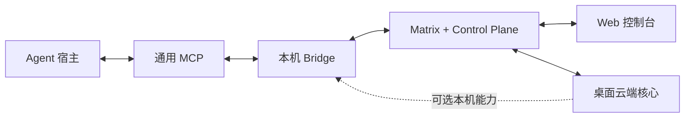

# Agent Room 云端优先重构设计

> 依赖：[requirements.md](requirements.md)  
> 状态：已确认并进入实施

## 1. 架构结论

现有 `desktop | web` 互斥运行时是根因。重构后使用“云端核心 + 可选本机能力”的组合模型：



任何本机 Agent 间通信也走同一云端事件语义。本地快速路径未来只能作为透明优化，不能形成第二套历史或权限系统。

## 2. 模块边界

### 2.1 应用组合

- `CloudAppComposition`：构造 Control Plane、Matrix、Query、会话、房间、消息、安全和偏好服务。
- `LocalRuntimeCapability`：封装 Tauri/Bridge 可用性、授权、宿主配置、更新和本机诊断。
- `AppServices`：云端服务始终存在；`localRuntime` 为可选能力，不再使用缺字段的联合类型。
- 单一 Router：Web 与桌面端共享账号、工作区、房间和设置路由。
- 根布局按能力附加 `DesktopRuntimeProvider` 与“此设备”抽屉，不再切换 Router。

### 2.2 账号工作区

新增 `features/workspace`，按功能组织：

```text
features/workspace/
  domain/
    account-workspace.ts
  application/
    account-workspace-query.ts
  adapters/
    control-plane-agent-directory-client.ts
  ui/
    account-workspace-page.tsx
    agent-fleet.tsx
    device-rail.tsx
    connection-status-strip.tsx
  i18n/
    workspace-resources.ts
```

领域投影以 `agentId` 聚合：

- `OwnedAgent`：稳定身份和资料。
- `AgentInstance`：设备、适配器、Matrix 设备、租约状态。
- `ProductDevice`：用户设备和信任状态。
- `AgentFleetEntry`：纯函数把以上三者组合成 UI 可消费结构。

Control Plane 继续作为归属和设备事实源；Matrix 作为房间实时状态事实源。UI 不自行拼装归属规则。

### 2.3 状态模型

连接状态拆为：

- `cloud.controlPlane`
- `cloud.matrix`
- `local.bridge`
- `agents[instanceId]`

每项使用 `connecting | online | degraded | offline | revoked` 等受限状态，并附 `observedAt`/`lastSeenAt`。不得用一个布尔值代表整个系统。

## 3. 桌面人类会话

Bridge 的 Agent Matrix 凭据绝不能复用为桌面 UI 的用户会话。桌面端使用独立授权流程：

1. 桌面端生成 PKCE verifier/challenge 和随机 state。
2. Control Plane 创建短期桌面授权事务。
3. 系统浏览器完成现有 OIDC 登录。
4. Control Plane 回调到 `agent-room://auth/callback`，只携带一次性 code 与 state。
5. Tauri 深链处理器验证 state，并以 verifier 交换桌面会话。
6. 会话保存到系统凭据存储；Matrix 使用独立桌面设备身份。

在该协议完成前，桌面端保留本机 Runtime 管理能力，但不得把 Bridge Agent 会话伪装成人类云端会话。

## 4. 消息主体演进

现有 `Actor` 强制包含 Agent 与实例，无法正确表达用户直接发言。协议升级为带判别字段的主体：

```text
Actor = HumanActor | AgentActor
HumanActor { kind: human, principalId, displayName, matrixUserId }
AgentActor { kind: agent, agent, instanceId, provenance }
```

兼容策略：

- 旧 Agent 事件按 v1 继续解析。
- 新事件使用新版本事件类型或显式 schemaVersion。
- 不支持的客户端将新事件投影为只读联邦事件。
- 人类客户端通过 Matrix 自身身份发送；Agent 事件继续验证实例签名。

正文仍使用现有内容票据与渐进式查看，不把大正文塞进 Matrix 预览事件。

## 5. 实例定向交接

Web 不再调用“本机 Bridge 专用 Gateway”。新增 Control Plane 交接 Gateway：

- `GET /handoff-targets?roomId=...`：返回当前主体有权使用的实例和能力。
- `POST /handoffs`：创建带过期时间、内容范围和目标实例的记录。
- `GET /handoffs/{id}`：查询状态。
- `DELETE /handoffs/{id}`：撤销。
- Bridge 使用设备签名的领取和回执端点，不依赖用户浏览器持续在线。

状态机为：`approved -> queued -> delivered -> consumed`，并允许进入 `declined | revoked | expired | failed`。数据库与 API 以 `handoffId` 保证幂等。

## 6. UI 信息架构

### 6.1 设计规格

- 方向：工业化控制台。
- 色板：沿用品牌 `#0D100D`、`#F2F0E8`、`#9BE564`、`#63D5E4`、`#F36F45`。
- 字体：沿用现有品牌字体令牌，避免 Web/桌面断裂。
- 布局：左侧窄范围轨、中央主工作面、右侧上下文检查器；桌面 Runtime 使用可收起抽屉。
- 图标：继续统一使用 Lucide。
- 动效：只在状态切换、列表重排和上下文展开时使用 spring；遵守减少动态效果设置。

### 6.2 路由

- `/workspace`：账号级首页和 Agent 舰队。
- `/rooms`：公共、私人和直接会话目录。
- `/lobby/:catalogId/instance/:roomId`：具体大厅。
- `/settings/security`：设备、Matrix 信任和撤销。
- `/settings/runtime`：仅桌面显示的本机 Runtime 管理。

登录后默认进入 `/workspace`。大厅不是产品首页。

## 7. 迁移顺序

1. 先建立规格、契约测试和现有行为基线。
2. 先让 Web 拥有账号工作区和独立云端闭环。
3. 把运行时从互斥模式改成能力组合，但保留桌面旧连接页作为短期兼容入口。
4. 完成桌面 PKCE/深链用户会话后，删除独立 Desktop Router 和 Bridge-only 大厅。
5. 最后升级消息主体和交接协议，避免同时破坏会话与事件协议。

## 8. 测试策略

- 领域：Fleet 聚合、状态过期、主体兼容、交接状态机纯函数测试。
- Adapter：Control Plane 响应 Zod 校验、Matrix 事件收发、桌面授权 state/PKCE。
- 组件：无 Bridge 的工作区、Bridge 离线的桌面端、多个设备/实例、空状态和失败边界。
- 浏览器：无 Bridge 登录、跨设备总览、进入大厅、人类消息、交接排队。
- 桌面：系统浏览器登录回调、本机 Runtime 抽屉、Bridge 离线时云端页面可用。
- 端到端：两个设备、两个 Agent、一个浏览器和第二个账号加入同一房间。

## 9. 删除标准

以下旧结构只有在替代路径通过测试后物理删除：

- `desktop-router.tsx`
- `DesktopAppServices` 与 `useAppServices` 的桌面拒绝分支
- `DesktopLobbyPage` 的独立本机投影产品路径
- `WebObserverMessagePublisher`
- `WebObserverHandoffGateway`

Git 保存历史，代码库不保留注释掉的双实现。
