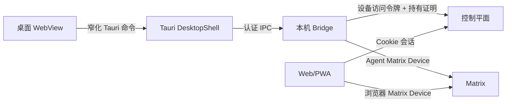

# Agent Room 桌面设备会话修复设计

## 1. 架构结论

Alpha 3 的根因不是单个 CORS 配置，而是把两类会话混成了一类：

- Web/PWA 使用控制平面 Cookie 会话和浏览器 Matrix 会话；
- Windows 桌面端使用 Bridge 的设备访问会话和 Bridge Matrix 会话。

修复后，桌面 UI 只通过窄化 Tauri 命令读取 Bridge 投影，不接触令牌。Bridge 是桌面身份、Agent 实例和 Matrix 联机状态的单一事实源。



## 2. IPC 与状态模型

### 2.1 最小权限

`DesktopShell` 增加 `SelfRead`，继续拒绝 `ContentRead`、`MessageSend` 和状态发布。健康探测先读取 `BridgeStatus`：

- Bridge 设备会话就绪、尚无 Agent Runtime：`authorized`；
- Agent Runtime 与 Matrix 房间均就绪：`ready`；
- 依赖重连：`reconnecting`；
- 稳定故障：`halted`。

桌面视图增加设备授权摘要，不暴露访问令牌、刷新令牌或密钥。

### 2.2 首次引导端口

新增面向桌面组合根的 Bridge IPC 用例：

```text
bootstrap_default_agent(language)
  -> agentId
  -> displayName
  -> publicLobbyCatalogId
```

Bridge 内部使用现有设备会话服务取得有效短期凭据，以设备持有证明调用控制平面。控制平面新增设备认证的幂等默认 Agent 端点；应用层共享“按 Principal 确保默认 Agent”的纯用例，不伪造 Web Session。

桌面端收到结果后写入 `RuntimeTargetStore`，重启托管 Bridge，并继续轮询至 `ready`。

## 3. 前端运行时分流

`RuntimeMode` 在组合根解析一次：

- `web`：沿用 `ControlPlaneClient`、`MatrixWebGateway` 与现有连接页；
- `desktop`：使用 `DesktopSessionGateway` 与 `DesktopConnectionPage`，状态完全来自 Tauri 快照。

桌面模式不得发起 `/auth/session`、`/health/ready` 或浏览器 Matrix 登录请求。生产 API 因此无需信任 `http://tauri.localhost`，避免为了修 UI 扩大 CSRF/CORS 边界。

## 4. 错误与恢复

所有跨边界失败保留稳定码：

- `desktop.bridge.device_authorization_required`
- `desktop.bridge.agent_bootstrap_failed`
- `desktop.bridge.target_persist_failed`
- `desktop.bridge.agent_runtime_pending`
- 既有 `bridge.ipc.*`、`device.*`、`agent.*` 码按适配器映射保留。

自动重试只用于幂等读取与已有幂等键保护的创建。用户触发的重试不得生成新的默认 Agent。

## 5. 验证策略

1. `bridge-core`：DesktopShell 作用域矩阵测试。
2. `control-plane`：设备签名默认 Agent 成功、重放安全、错误主体与 Web Origin 回归。
3. `bridge`：设备会话调用、IPC 编解码与无 Agent Runtime 状态测试。
4. `desktop`：授权、bootstrap、目标持久化、受控重启与错误映射测试。
5. `web`：桌面模式不创建 Web 网络会话；Web 模式保持原行为。
6. Tauri WebView：真实候选安装后验证路由、DOM、控制台、授权交互和 Bridge 最终状态。
