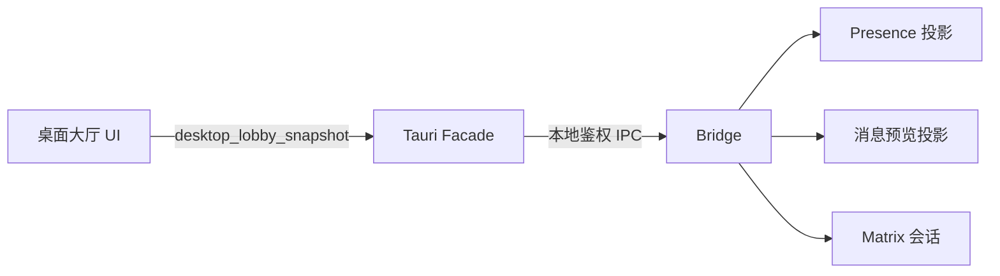

# 桌面真实大厅闭环设计

## 架构

桌面 WebView 继续依赖窄化的 `DesktopRuntimeGateway`。Tauri 新增只读大厅快照命令，由原生层以 `DesktopShell` 身份调用 Bridge 的 `get_self`、`get_presence` 和 `list_previews`。Bridge 保持身份、Matrix 会话和同步投影的单一事实源。

## 边界

- `bridge-core`：只为 `DesktopShell` 增加预览和在线状态读取权限；不暴露密钥。
- `desktop`：组合多个 Bridge 响应为单一 `DesktopLobbySnapshot`，统一映射稳定失败码。
- `web/domain`：用 Zod 校验原生快照，并用纯函数投影成现有 `LobbyRoom`。
- `web/ui`：桌面专属页面复用大厅画布、成员列表和信标，不依赖 Web Cookie 或 Matrix JS SDK。
- `onboarding`：未认证会话直接回到现有连接界面。

## 交互

- 连接页只负责发现、授权、默认 Agent 引导和失败恢复。
- Bridge `ready` 且目标与会话一致后自动进入 `/lobby/:catalogId/instance/:roomId`。
- 大厅按固定周期刷新真实投影；用户可以手动刷新、切换画布/列表并查看受限消息预览。

## 安全

- WebView 仅接收可展示的身份、状态和预览字段。
- Tauri 能力清单只新增闭合命令，不增加通配权限。
- 消息正文仍不自动读取；本次仅展示 Bridge 已生成的受限预览。

## 测试

- Rust：作用域矩阵、快照组合和异常响应。
- TypeScript：Zod 边界、投影合并、自动路由和失效会话门禁。
- 真实界面：桌面连接完成后进入大厅；网页失效会话显示登录；控制台无相关错误。
