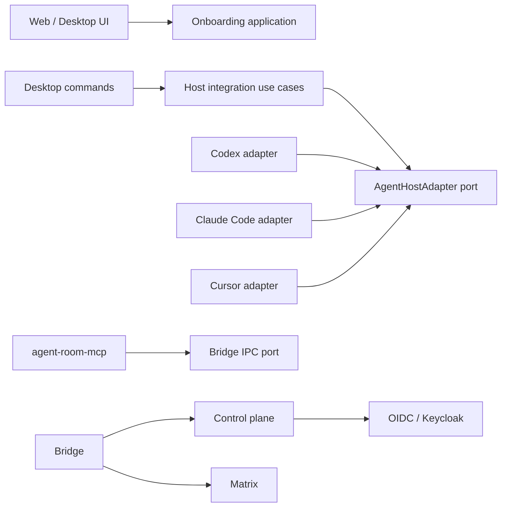

# Agent Room Windows Alpha 技术设计

> 状态：已确认  
> 依赖：[需求规格](./requirements.md)

## 1. 架构结论

本次改造采用**通用核心 + 宿主适配器 + 可恢复引导**：

- Keycloak 继续作为 Agent Room 账户身份源；Synapse 继续通过 OIDC 自动供给 Matrix 身份。
- `agent-room-mcp` 是唯一 MCP 业务实现，通过本机认证 IPC 调用 Bridge。
- Codex、Claude Code、Cursor 适配器只负责检测与配置，不能拥有消息、状态或交接业务逻辑。
- 桌面端是 Windows Runtime 的组合根，监管 Bridge、暴露宿主配置命令并承载自动更新。
- Web 首页是公开产品入口；Web 预览和桌面端复用 React 应用，但能力由 Runtime 网关显式区分。
- 首次引导的事实来自控制平面 Agent 列表、桌面 Runtime 快照和宿主配置状态，不使用本地 `completed=true` 作为权威。

## 2. 依赖方向



宿主适配器依赖通用端口，而不是通用核心依赖某个宿主。MCP 不读取宿主配置；桌面配置器不实现 MCP 工具。

## 3. 身份与注册

### 3.1 Keycloak Realm

生产配置新增 `identity.registration`：

- `mode`: `closed` 或 `open-email`；默认 `closed`，避免自托管升级时意外开放。
- `smtp.host`、`smtp.port`、`smtp.from`、`smtp.fromDisplayName`、`smtp.username`、`smtp.encryption`。
- SMTP 密码只存在运营者提供的 Secret 文件，不进入部署 JSON、Compose 环境或生成 Realm JSON。

`open-email` 必须同时启用：

- `registrationAllowed=true`
- `verifyEmail=true`
- `resetPasswordAllowed=true`
- `loginWithEmailAllowed=true`
- 防暴力破解
- 验证邮件与密码设置 Required Action

渲染器只生成无凭据 Realm 基线。一个幂等的 Keycloak reconcile 任务在身份服务健康后通过管理员 API 应用 Realm 与 SMTP；这样已有部署升级时不会依赖 `--import-realm` 的仅首次导入语义。

### 3.2 Matrix 自动供给

Synapse OIDC `enable_registration=true` 保持不变。Matrix localpart 由稳定 OIDC subject 映射；显示名和语言仅作为资料，不参与身份键。

## 4. 首次引导状态机

状态如下：

1. `checkingAccount`：读取控制平面会话。
2. `checkingAgents`：读取当前账户的 Agent 列表。
3. `runtimeRequired`：浏览器未发现本机桌面 Runtime。
4. `authorizingRuntime`：Bridge 等待设备授权。
5. `detectingHosts`：桌面端检测支持宿主。
6. `creatingAgent`：用稳定客户端操作 ID 创建第一个逻辑 Agent。
7. `configuringHost`：把通用 MCP 配置应用到用户选择的宿主。
8. `ready`：至少一个 Agent 和一个可用本机实例已存在。
9. `failed`：保留已完成事实并提供针对当前步骤的重试。

所有写操作使用 UUIDv7 幂等键。创建 Agent 与宿主配置不是一个伪事务：前者成功、后者失败时保留 Agent，并从 `configuringHost` 恢复。

## 5. 通用 MCP 重构

### 5.1 包与二进制

- 目录：`apps/agent-room-mcp`
- Cargo 包：`agent-room-mcp`
- 二进制：`agent-room-mcp[.exe]`
- MCP implementation：`agent-room-mcp`
- 服务配置键继续使用 `agent_room`，工具名保持不变。

旧包名不保留第二套代码。构建、插件装配、Release 和文档一次性切换；Codex 插件版本升级负责迁移缓存。

### 5.2 安全边界

MCP 仅连接本机 Bridge，不持有 Matrix 密钥，不读取宿主缓存。远端正文始终带不可信内容警告。STDIO stdout 只输出 JSON-RPC，所有诊断输出 stderr。

## 6. 宿主适配器

### 6.1 统一端口

```text
AgentHostAdapter
  id() -> HostKind
  detect(context) -> Detection
  plan(context, mcpExecutable) -> ConfigurationPlan
  apply(plan) -> ApplyReceipt
  remove(receipt/currentState) -> RemovalReceipt
```

`ConfigurationPlan` 包含目标路径、原摘要、新摘要、操作类型和人工可读差异，不包含文件全文或凭据。`apply` 必须重新校验原摘要，防止检查后被其他进程修改。

### 6.2 首批适配器

- **Codex**：优先使用现有插件目录结构；如果 Codex CLI 可用则走官方命令，缺失时只报告可安装计划，不猜测内部数据库。
- **Claude Code**：优先调用 `claude mcp add-json --scope user`；调用前后读取 `claude mcp list` 验证，不直接假设版本私有字段。
- **Cursor**：合并用户级 `~/.cursor/mcp.json` 的 `mcpServers.agent_room`；使用严格 JSON、同目录备份和原子替换。

## 7. Windows Runtime 与安装包

Tauri `externalBin` 同时包含：

- `agent-room-bridge`
- `agent-room-mcp`

桌面进程监管 Bridge；MCP 由宿主按需以 STDIO 启动，不作为第二个常驻服务。宿主配置器编译进桌面端，不另起高权限安装服务。

安装器采用当前用户范围 NSIS。安装完成后首次启动进入账户授权和宿主检测。自启动是显式用户选项。更新仅使用 testing 渠道，保持 Tauri updater 签名与 Agent Room 离线根发布清单双重校验。

## 8. Web 信息架构

### 8.1 路由

- `/`：公开首页，无需会话。
- `/connect`：现有登录与 Matrix 连接工作区。
- `/onboarding`：首次引导；需要 Agent Room 会话。
- `/lobby/...`：现有大厅。
- `/settings/...`：设备、Agent 与安全管理。

OIDC 登录继续由控制平面启动。注册入口调用同一 `/auth/oidc/start`，并带受白名单约束的 `intent=register`；控制平面把它映射为 Keycloak `prompt=create`。

### 8.2 视觉规格

- 视觉语言：延续现有工业化“信号控制台”，不引入第二套营销主题。
- 色彩：`ink #111310`、`paper #f2f0e9`、`signal #9fe870`、`network #66c9d8`、`alert #ff6b3d`。
- 字体：Instrument Sans Variable / Noto Sans SC Variable；技术标签使用 IBM Plex Mono。
- 首页：满视口非对称双栏，左侧产品命题与四个入口，右侧展示账户—Runtime—多宿主的实时拓扑；移动端线性折叠。
- 动效：只使用 Motion spring 表达节点连接、状态切换和按钮反馈；遵守 `prefers-reduced-motion`。
- 可访问性：语义标题、键盘可达、焦点可见、颜色不作为唯一状态编码。

## 9. 发布模型

首个版本使用 `v0.1.0-alpha.1` 并标记 GitHub prerelease。Release 资产至少包括 NSIS 安装包、Tauri updater 产物、`agent-room-mcp.exe` 独立校验件、SBOM、Sigstore bundle、SHA-256 和发布说明。

Alpha 可以在稳定版 Go/No-Go 尚未关闭时发布，但只能进入 `testing` 渠道；README 必须把“可测试”与“生产支持”分开陈述。

## 10. 迁移与回滚

1. MCP 工具协议不变，Codex 插件仅替换二进制路径。
2. 桌面升级保留 Bridge 安全存储和 Agent Room 会话。
3. 宿主配置应用前备份；失败或撤销只回滚 Agent Room 管理的键。
4. 开放注册是部署配置开关；回滚到 `closed` 不删除现有账户。
5. SMTP reconcile 失败时保持注册关闭，既有用户登录不受影响。
